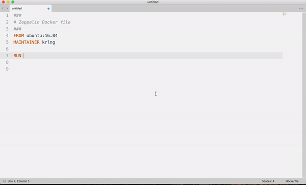

# CheatSheet Alfred Integration

Search Elasticsearch Database which gets filled with parsed cheatsheet markdown files. See:

* [Markdown CheatSheets](https://gitlab.com/kreiling/cheatsheets)
* [Build Pipeline](https://gitlab.com/kreiling/buildCV)



## Setup
```sh
# Install dependencies
pip install --target=. Alfred-Workflow
pip install -t lib -r req.txt

# Create symlink
export workflowsdir='/Users/'$(whoami)'/Library/Application Support/Alfred 3/Alfred.alfredpreferences/workflows'
ln -s $(pwd) $workflowsdir/cheatsheets-workflow
```